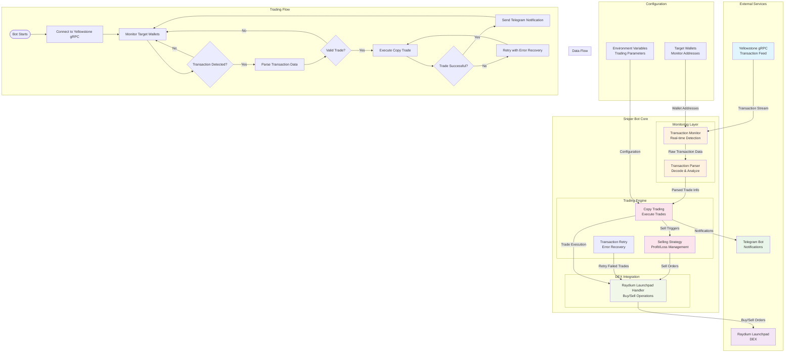

# Lets Bonk Dot Fun Sniper Bot

This is a high-performance Rust-based sniper trading bot that monitors and executes trades on the Let's Bonk Dot Fun platform using Raydium Launchpad. The bot uses advanced transaction monitoring to detect and execute trades in real-time, giving you an edge in the market.

The bot specifically tracks `buy` and `sell` transactions on Raydium Launchpad for Let's Bonk Dot Fun tokens, providing fast execution and automated trading capabilities.

## Features:

- **Real-time Transaction Monitoring** - Uses Yellowstone gRPC to monitor transactions with minimal latency and high reliability
- **Raydium Launchpad Integration** - Optimized for Let's Bonk Dot Fun platform trading
- **Automated Copy Trading** - Instantly replicates buy and sell transactions from monitored wallets
- **Smart Transaction Parsing** - Advanced transaction analysis to accurately identify and process trading activities
- **Configurable Trading Parameters** - Customizable settings for trade amounts, timing, and risk management
- **Built-in Selling Strategy** - Intelligent profit-taking mechanisms with customizable exit conditions
- **Performance Optimization** - Efficient async processing with tokio for high-throughput transaction handling
- **Reliable Error Recovery** - Automatic reconnection and retry mechanisms for uninterrupted operation

## Architecture Diagram



## Who is it for?

- Bot users looking for the fastest transaction feed possible for Let's Bonk Dot Fun trading
- Traders who want automated execution on Raydium Launchpad
- Users who want to copy trade from successful wallets

## Setting up

### Environment Variables

Before run, you will need to add the following environment variables to your `.env` file:

- `GRPC_ENDPOINT` - Your Geyser RPC endpoint url.
- `GRPC_X_TOKEN` - Leave it set to `None` if your Geyser RPC does not require a token for authentication.
- `GRPC_SERVER_ENDPOINT` - The address of its gRPC server. By default is set at `0.0.0.0:50051`.
- `COPY_TRADING_TARGET_ADDRESS` - Wallet address(es) to monitor for trades (comma-separated for multiple addresses)

### Telegram Notifications

To enable Telegram notifications:

- `TELEGRAM_BOT_TOKEN` - Your Telegram bot token
- `TELEGRAM_CHAT_ID` - Your chat ID for receiving notifications

### Optional Variables

- `IS_MULTI_COPY_TRADING` - Set to `true` to monitor multiple addresses (default: `false`)
- `PROTOCOL_PREFERENCE` - Set to `raydium` for Raydium Launchpad (default: `auto`)
- `COUNTER_LIMIT` - Maximum number of trades to execute
- `SELLING_TIME` - Time in seconds before selling (default: 600)
- `PROFIT_PERCENTAGE` - Profit percentage for selling (default: 20.0)
- `STOP_LOSS_PERCENTAGE` - Stop loss percentage (default: 10.0)

## Run Command

```bash
# Build the project
cargo build --release

# Run the bot
RUSTFLAGS="-C target-cpu=native" RUST_LOG=info cargo run --release
```

## Project Structure

The codebase is organized into several modules:

- **engine/** - Core trading logic including copy trading, selling strategies, and transaction parsing
- **dex/** - Protocol-specific implementations for Raydium Launchpad
- **common/** - Shared utilities, configuration, and constants
- **core/** - Core system functionality
- **error/** - Error handling and definitions
- **services/** - External service integrations (RPC, blockhash processing, etc.)

## Usage

Once started, the bot will:

1. Connect to the Yellowstone gRPC endpoint
2. Monitor transactions from the specified wallet address(es)
3. Automatically copy buy and sell transactions as they occur
4. Send notifications via Telegram for detected transactions and executed trades
5. Execute trades on Raydium Launchpad for Let's Bonk Dot Fun tokens

## Recent Updates

- Removed PumpFun and PumpSwap support
- Focused on Raydium Launchpad integration for Let's Bonk Dot Fun
- Implemented concurrent transaction processing using tokio tasks
- Enhanced error handling and reporting
- Improved selling strategy implementation

## Contact

For questions or support, please contact the developer.

## Disclaimer

This bot is for educational purposes only. Trading cryptocurrencies involves substantial risk of loss and is not suitable for all investors. The past performance of any trading system or methodology is not necessarily indicative of future results.